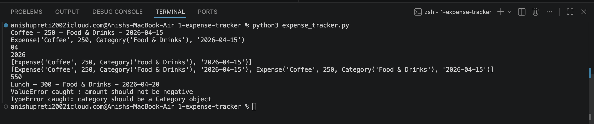

# Expense Tracker

This is a simple expense tracker built using OOP implementing concepts from classes, dunder methods, simple error handling and file I/O that allows us to keep track of expenses in different things and export that to csv.

## Why I Built This

As I was going through OOP, error handling, file I/O concepts, I thought I will build this to somehow solidify my knowledge even if little.

## What It Does

- Add, remove, and filter expenses by category
- Generate monthly spending summaries
- Export all expenses to CSV
- Input validation with proper error handling

## Classes & Structure

### `Category`
Represents an expense category (e.g. Food & Drinks, Travel).
Uses `__str__` to display cleanly and `__repr__` to show a 
reconstructable representation.

### `Expense`
Core data class holding item, amount, category, and date.

- `__str__` — human readable output for printing
- `__repr__` — reconstructable representation for debugging
- `@property month / year` — extracts month and year from date 
  string without storing them separately
- `from_string()` — class method alternative constructor, 
  creates an Expense directly from a CSV-style string

### `ExpenseTracker`
Manages the full list of expenses.
Handles add, remove, filter, monthly summary, and CSV export.

## Concepts Demonstrated

| Concept | Where Used |
|---|---|
| OOP — classes, `__init__`, methods | All three classes |
| `__str__` and `__repr__` dunders | Category, Expense |
| `@property` for computed fields | month, year in Expense |
| Class methods as alternative constructors | `Expense.from_string()` |
| Error handling and validation | Expense `__init__` |
| File I/O with csv module | `export_to_csv()` |

## Sample Output

### Note: This small project is completed by me taking help from external source when stuck, ps the readme is half generate by AI and half edited by me(bcoz it will be quite boring to write whole readme by myself🙃)