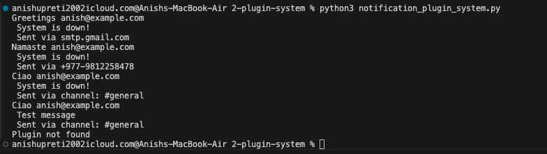

#  Notification Plugin System


## What is this?

A notification plugin system built from scratch in Python. The idea is simple — our app shouldn't care how a notification gets sent. It just says "notify everyone" and the system handles the rest. Email, SMS, Slack — all plugged in, all interchangeable.

This is the same pattern used in VS Code extensions, FastAPI middleware, LangChain tools, and Django signals. Real frameworks are built this way.

---

## What I built

- An Abstract Base Class `NotificationPlugin` that enforces a contract on every plugin
- 3 concrete plugins — `EmailPlugin`, `SMSPlugin`, `SlackPlugin`
- A `PluginManager` that registers plugins and notifies them — without knowing or caring what they are
- Message validation via `@staticmethod`
- Every notification logged to `notification.log` files.
- `notify_one()` to target a specific plugin by name

---

## How to add a new plugin in 5 lines

That's the whole point of this system. Say you want WhatsApp:

```python
class WhatsAppPlugin(NotificationPlugin):
    def __init__(self, number):
        self.number = number

    def send(self, message, recipient):
        print(f"WhatsApp to {recipient}: {message} via {self.number}")
```

Then just register it:
```python
manager.register(WhatsAppPlugin("+977-9800000000"))
```

Zero changes to existing code. The `notify_all()` call stays exactly the same.
This is the **Open/Closed Principle** — open for extension, closed for modification.

```Open/Closed Principle```  
"Open for extension" = we can add new things (new plugins)
"Closed for modification" = without touching the existing code
Like a power socket. The wall is "closed" i.e. we never rewire it. But it's "open" i.e. we plug in anything that fits. For example, we can add WhatsApp by writing a new class and without touching zero existing code as in above code.

---

## Why Abstract Classes enforce contracts

`NotificationPlugin` is an ABC — Abstract Base Class. It defines what every plugin *must* have. If we create a plugin and forget to implement `send()`, Python throws a `TypeError` immediately when we try to instantiate it.

```python
# This blows up instantly:
p = NotificationPlugin()
# TypeError: Can't instantiate abstract class
```

This is better than finding out something is broken at runtime, deep inside our app. The contract is enforced at the door.

Here, enforced at the door means without ABC, our WhatsAppPlugin could forget to implement send() and we'd only find out when our app tries to send a notification and crashes. With ABC, Python tells us the moment we try to create the object before anything runs.

---

## Concepts demonstrated

| Concept | Where |
|---|---|
| Abstract Base Classes | `NotificationPlugin` |
| Enforced interfaces via `@abstractmethod` | `send()` method |
| Inheritance | `EmailPlugin`, `SMSPlugin`, `SlackPlugin` |
| Polymorphism | `notify_all()` calls `send()` on any plugin |
| `@staticmethod` | `validate_message()` |
| File I/O | `notification.log` |
| `for/else` pattern | `notify_one()` |

---

## Polymorphism — the quiet hero

`notify_all()` looks like this:

```python
def notify_all(self, message, recipient):
    for plugin in self.plugins:
        plugin.send(message, recipient)
```

It doesn't know if `plugin` is an Email, SMS, or Slack plugin. It just calls `send()` and each plugin does its own thing. Same method name, different behaviour. That's polymorphism — and it is why this system scales.

---

## Real systems that use this pattern

- **FastAPI middleware** — each middleware is a plugin that wraps requests  
When a request comes into our API, middleware sits in between and does something like checking if the user is logged in, or logging the request. Each middleware is independent, plugged in, does its thing. FastAPI doesn't care what's inside it, just that it follows the interface.

- **Django signals** — receivers are plugins that respond to events  
When something happens in Django — like a user registers — Django "signals" it. Other parts of your app can "listen" to that signal and react. Each listener is independent, like a plugin. Django doesn't know or care what the listeners do.

- **LangChain tools** — every tool follows the same interface, the agent doesn't care which one it calls   
In LangChain, an AI agent can use tools like a calculator, a search engine, a database. Each tool follows the same interface. The agent just calls tool.run() and doesn't care if it's a calculator or Google.

- **VS Code extensions** — the editor just calls the API, extensions implement it  
VS Code doesn't know about Python, Git, or Prettier. Those are extensions — plugins. VS Code just provides the interface (the socket). Extensions implement it. You install one, it works. You remove it, nothing breaks.
---

## What I learned building this

I simply implemented the concepts of classes and objects, inheritance, ABC, polymorphism, file I/O, etc. I also learned a little about plugin system and open/closed principle.

---

## Sample output


### Note: This is the second project that I implemented in this repository, and it seems even smaller than the first one, the concepts are also somewhat similar but also different. Like before I took help from external source when I got stuck, and  the readme is half generated by AI and half edited by me.