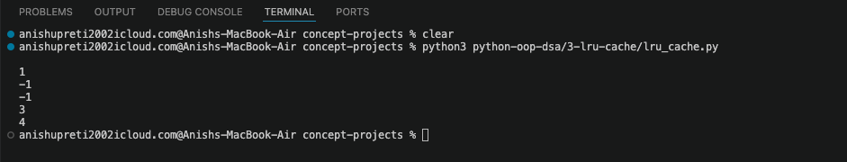

# LRU Cache

An LRU (Least Recently Used) cache built from scratch using a hash map and a doubly linked list — the same combination that powers Redis, CPU caches, and browser history.

## Why I Built This

Recently I was learing about arrays and hash maps. By the end of the week I could solve Two Sum in my sleep. But an LRU Cache forces you to combine two data structures — a hash map for O(1) lookup and a doubly linked list for O(1) eviction — and get them to work together. That's harder than knowing each one separately.

It is also LeetCode problem 146, which is important for backend/systems interview.

---

## What It Does

- `get(key)` - returns the value if it exists, -1 if not. Also marks the item as recently used.
- `put(key, value)` - inserts or updates. If the cache is at capacity, evicts the **least recently used** item first.
- Both operations run in **O(1) time**.

---

## Why Hash Map + Doubly Linked List?

This is the core insight of the whole project.

We need to do two things simultaneously:  
"Find this item instantly" - that's the hash map's job. O(1) lookup.  
"Know which item was used least recently" - that's the linked list's job. It keeps items in order of recency.

A hash map alone gives O(1) lookup — but we can't efficiently track which item was used least recently.

A linked list alone can track order — but finding an item by key takes O(n).

Together:
- Hash map: `key → node` (O(1) jump to the exact node)
- Doubly linked list: nodes in order of recency, most recent at front, least recent at tail
- Doubly (not singly) linked because removing a node requires updating both its previous and next neighbor - we need both pointers

**Why not an array or a singly linked list?**
Arrays and singly linked lists can't remove an arbitrary node in O(1). You'd have to scan to find the node's predecessor. The doubly linked list solves this — every node already holds a pointer to its predecessor.  

The prev pointer is the key difference. Without it, we cannot remove a node in O(1).

---

## Design

```
hash map:  { key: node }

doubly linked list (most recent → least recent):
  HEAD ↔ [node A] ↔ [node B] ↔ [node C] ↔ TAIL
```

`HEAD` and `TAIL` are dummy sentinel nodes. They hold no real data -  they just eliminate all the null checks when inserting or removing at the boundaries. Every real node sits between them.

They are just fixed anchors at the end.

So why do they exist then?  
It is because without them, HEAD and TAIL are dummy nodes — they hold no real data. They're just fixed anchors at each end.

Why do they exist?
Without them, inserting or removing at the boundaries requires special cases:

"Is this the first node? Then there's no prev, so handle differently."
"Is this the last node? Then there's no next, so handle differently."  
With sentinel nodes, there are NO boundary cases. Every real node always has a prev and a next - even if that prev/next is just HEAD or TAIL. Our _remove and _insert_front methods become clean and identical for every node.

It's like adding a fake "start" and "end" card to a deck so you never have to check if you're at the edge.

**get(key):**
1. Key not in map → return -1
2. Remove node from current position
3. Insert at front (just after HEAD) → now it's "most recently used"
4. Return value

**put(key, value):**
1. Key exists → update value, move to front
2. Key doesn't exist:
   - Create new node, add to front, add to map
   - If over capacity → remove node at `TAIL.prev` (the least recently used), remove its key from map

---

## Classes

### `Node`
Holds `key`, `val`, and pointers to `prev` and `next` nodes.

### `LRUCache`
- `__init__(capacity)` — sets up map, dummy HEAD, dummy TAIL, links them together
- `_remove(node)` — rewires neighbors to skip over this node
- `_insert_front(node)` — inserts node directly after HEAD
- `get(key)` — lookup + move to front
- `put(key, value)` — insert/update + evict if needed

---

## Complexity

| Operation | Time | Space |
|-----------|------|-------|
| get       | O(1) | O(1)  |
| put       | O(1) | O(1)  |
| Overall   | —    | O(capacity) |

The dash is because "overall time complexity" doesn't mean anything for a data structure — time complexity only applies to a specific operation. There's no single "run the whole cache" action to measure.

get has a time complexity. put has a time complexity. "The cache" doesn't.

Space is different — the entire structure exists in memory at once, so we can ask "how much memory does this cache use?" — and the answer is O(capacity), because at most we hold capacity nodes in the list and capacity entries in the hash map.


---

## Edge Cases Tested

- `capacity = 1` — every put evicts the previous item
- `get` on a non-existent key → -1
- `put` on an existing key → updates value, moves to front
- Eviction order — the item not touched longest goes first
- `get` after eviction → -1

---

## Real-World Connection

This exact pattern - hash map + doubly linked list - is how Redis implements its LRU eviction policy. When Redis runs out of memory, it needs to evict keys. The structure that makes that O(1) is the same one built here.

our CPU has an L1/L2 cache with similar logic. When cache lines fill up, the least recently used gets evicted.

our browser's back button keeps the most recent pages accessible and drops the oldest ones when memory is low. Same idea.

### Sample output


Note: This readme is generated with help of LLM model and then edited by me. I read through the read me and edited some parts to make it consistent with project and other readmes.