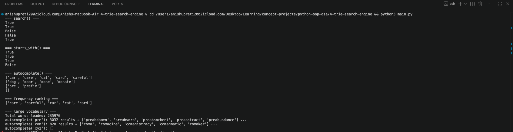

# Trie Search Engine

An autocomplete search engine built from scratch using a Trie (prefix tree) - the same data structure that powers Google's search suggestions, phone keyboard autocomplete, and spell checkers.

## Why I Built This

After spending some time on trees and recursion, the Saturday project was to build something that actually uses tree traversal for a real purpose. A Trie is one of those structures that looks complicated on paper but clicks the moment you think about it the right way.

The question that motivated it: why can't a hash map do autocomplete?

A hash map can tell you "does this exact word exist?" in O(1). But "give me all words starting with `pre`"? You'd have to scan every single key. That's O(n) — unusable at scale.

A Trie solves this by organizing words letter by letter. Every path from root to a marked node spells a complete word. To find all words with a prefix, you just walk to the end of that prefix and collect everything below it.

---

## How a Trie Works

Each node stores:
- `children` — a dictionary mapping a letter to the next node
- `is_end_of_word` — marks whether a complete word ends here
- `frequency` — how many times this word has been searched (used for ranking)

Inserting `"cat"`, `"car"`, `"card"`:

```
root
└── c
    └── a
        ├── t  ✓  ("cat")
        └── r  ✓  ("car")
            └── d  ✓  ("card")
```

`"car"` and `"card"` share the same path up to `r`. Only one new node (`d`) was created for `"card"`. That shared structure is why Tries are memory-efficient for words with common prefixes.

---

## Methods

### `insert(word)` — O(m)

Walks the word letter by letter from root. Creates a new node for any letter that doesn't exist yet, then moves into it. After the loop, marks the final node as a word end.

```
insert("car"):
  root → 'c' (new) → 'a' (new) → 'r' (new) → is_end_of_word = True

insert("card"):
  root → 'c' (exists) → 'a' (exists) → 'r' (exists) → 'd' (new) → is_end_of_word = True
```

Only one new node created for "card" because "car" was already there.

---

### `search(word)` — O(m)

Walks letter by letter. If any letter is missing, returns `False` immediately. After the loop, checks `is_end_of_word` — this is what distinguishes `"car"` (a word) from `"ca"` (just a prefix).

Also increments `frequency` on the final node each time the word is found — used for ranking autocomplete suggestions.

```python
search("car")   # True  — exists and is_end_of_word = True
search("ca")    # False — path exists but 'a' node is not a word end
search("xyz")   # False — 'x' doesn't exist at root
```

---

### `starts_with(prefix)` — O(m)

Same walk as `search`, but doesn't check `is_end_of_word` at the end. It only cares whether the prefix path exists at all.

```python
starts_with("ca")   # True  — path c → a exists
starts_with("xyz")  # False — no 'x' at root
```

---

### `autocomplete(prefix)` — O(m + n)

Two steps:

**Step 1** — Walk to the prefix node (same as `starts_with`). If prefix not found, return `[]`.

**Step 2** — Run DFS from that node downward, collecting every path that ends at `is_end_of_word = True`. Each result is collected as `(frequency, word)` so we can sort by frequency before returning.

```python
autocomplete("ca")
# walks to 'a' node, then DFS collects:
# → ['cat', 'car', 'card', 'care', 'careful']  (sorted by search frequency)

autocomplete("do")
# → ['dog', 'door', 'done', 'donate']

autocomplete("xyz")
# → []  (prefix not found)
```

**Frequency ranking in action:**

```python
trie.search("careful")  # ×3  →  frequency = 3
trie.search("care")     # ×2  →  frequency = 2
trie.search("car")      # ×1  →  frequency = 1

trie.autocomplete("ca")
# → ['careful', 'care', 'car', 'cat', 'card']
#      ×3         ×2      ×1     ×0     ×0
```

---

## Trie vs Hash Map

| Operation | Hash Map | Trie |
|---|---|---|
| Exact word lookup | O(1) | O(m) |
| Prefix search | O(n) scan all keys | O(m + results) |
| Autocomplete | Not possible efficiently | Natural — just DFS |
| Memory (shared prefixes) | Stores full word each time | Shares common paths |

m = word/prefix length, n = total words in structure

The hash map wins on exact lookup. The Trie wins on everything related to prefixes.

---

## Complexity

| Operation | Time | Space |
|---|---|---|
| insert | O(m) | O(m) worst case |
| search | O(m) | O(1) |
| starts_with | O(m) | O(1) |
| autocomplete | O(m + k) | O(k) |

m = length of word/prefix, k = number of matching results

---

## Large Vocabulary Test

Loaded the entire Unix dictionary — 235,976 words:

```
autocomplete('pre') → 3,032 matching words
autocomplete('com') →   828 matching words
autocomplete('xyz') →     0 matching words
```

All three run instantly. That's the Trie doing its job — no scanning, just walking a path.

---

## Real-World Connection

- **Google Search** — as you type, suggestions appear instantly. Walking a Trie to the current prefix and collecting the top-k frequent completions is exactly this.
- **Phone keyboard autocomplete** — your keyboard ranks word suggestions by how often you use them. Same frequency tracking built here.
- **Spell checkers** — checking if a word exists in a dictionary of 200k+ words in O(m) time.
- **IP routing tables** — routers use a form of Trie (Patricia tree) to match IP address prefixes to routes.

---

## Sample Output



Note: This README was drafted with help of an LLM and then edited by me. I read through it and adjusted parts to match the project.
